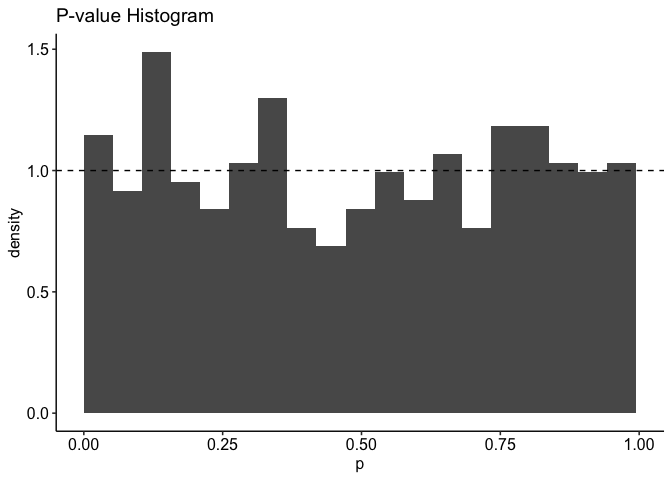
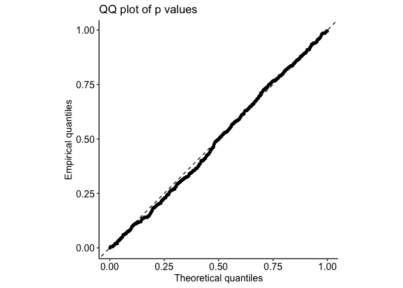

<!-- README.md is generated from README.Rmd. Please edit that file -->

# abimaQ

<!-- badges: start -->

<!-- badges: end -->

## Overview

**abimaQ** implements the **Adaptive Bootstrap (AB)** test for
**quantile mediation analysis** using **Gaussian copula SEM** and
flexible **GLM margins** for exposure (X), mediator (M), and outcome
(Y).  
For details, see Chen, Canyi, Yinqiu He, Huixia J. Wang, Gongjun Xu, and
Peter X.-K. Song. 2024. “Quantile Mediation Analytics.”
arXiv:2412.15401. Preprint, arXiv, December 19.
<https://doi.org/10.48550/arXiv.2412.15401>.

## Installation

You can install the development version from GitHub:

``` r
# install.packages("devtools")
devtools::install_github("canyi-chen/abimaQ")
```

## Core Functions

| Function | Purpose |
|----|----|
| `gen_data_quantile_mediation()` | Simulate data from a Gaussian-copula SEM |
| `estimate_quantile_mediation_AB()` | Estimate quantile mediation effects (plug-in) |
| `QMA_AB()` | Adaptive bootstrap test for quantile mediation effect |

## Quick Start

``` r
library(abimaQ)

# 1. Generate data
set.seed(123)
dat <- gen_data_quantile_mediation(n = 400, alpha = 0.6, beta = 0.8, gamma = 0.3)

# 2. Specify covariate columns (after X, M, Y)
W_cols <- 4:ncol(dat)

# 3. Estimate quantile indirect effect at tau = 0.5
est <- estimate_quantile_mediation_AB(
  data = dat,
  tau = 0.5,
  x0 = 0,
  x1 = 1,
  W_cols = W_cols,
  W_X_cols = 1:2,
  W_M_cols = 1:length(W_cols),
  W_Y_cols = 1:length(W_cols),
  W_new = matrix(0, 1, length(W_cols)),
  fam_X = gaussian(),
  fam_M = gaussian(),
  fam_Y = Gamma(link = "log")
)

est$NIQE_hat
#> [1] 0.8535741
```

## Inference with Adaptive Bootstrap

``` r
# 4. Run AB test
pval <- QMA_AB(
  data = dat,
  R = 200,                    # bootstrap replicates
  tau = 0.5,
  x0 = 0,
  x1 = 1,
  W_cols = W_cols,
  W_X_cols = 1:2,
  W_M_cols = 1:length(W_cols),
  W_Y_cols = 1:length(W_cols),
  W_new = matrix(0, 1, length(W_cols)),
  fam_X = gaussian(),
  fam_M = gaussian(),
  fam_Y = Gamma(link = "log")
)

pval
#> [1] 0
```

## Validation of the Distribution of P-values under the Null ($`\alpha*\beta = 0`$)

``` r
library(future.apply)
plan(multisession, workers = parallel::detectCores() - 1)

source("sim_qq_plot.R")  # contains simulate_pvals()
res <- simulate_pvals(
  Nrep = 500,
  n = 300,
  tau = 0.5,
  alpha = 0,
  beta = 1,
  gamma = 1,
  Rboot = 200
)
#> Warning: glm.fit: algorithm did not converge
#> Warning: glm.fit: algorithm did not converge
#> Warning: glm.fit: algorithm did not converge
#> Warning: glm.fit: algorithm did not converge
#> Warning: glm.fit: algorithm did not converge
#> Warning: glm.fit: algorithm did not converge
#> Warning: glm.fit: algorithm did not converge
#> Warning: glm.fit: algorithm did not converge
#> Warning: glm.fit: algorithm did not converge
```

``` r

res$rates     # rejection rates at 1%, 5%, 10%
#>  alpha_1%  alpha_5% alpha_10% 
#>     0.014     0.056     0.102
```

``` r
res$ks        # KS test against Uniform(0,1)
#> 
#>  Asymptotic one-sample Kolmogorov-Smirnov test
#> 
#> data:  pvals
#> D = 0.037, p-value = 0.5004
#> alternative hypothesis: two-sided
```

``` r

# Diagnostic plot
plots <- plot_pval_diagnostics(res$pvals)
print(plots$hist)
```



``` r
print(plots$qq)
```



## Supported Marginal Families

- `gaussian()`
- `poisson()`
- `binomial()`
- `Gamma(link = "log")` (Exponential when shape = 1)
- `inverse.gaussian()`
- `negative.binomial()` (with size parameter)

> ⚡ You can mix different families for X, M, and Y.
